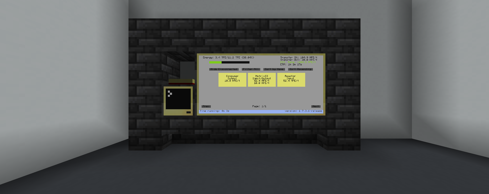
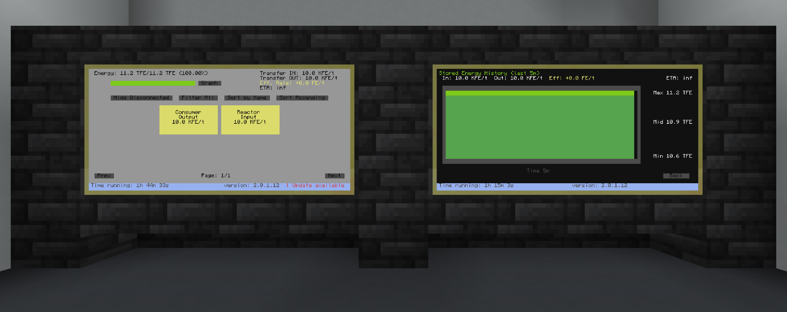
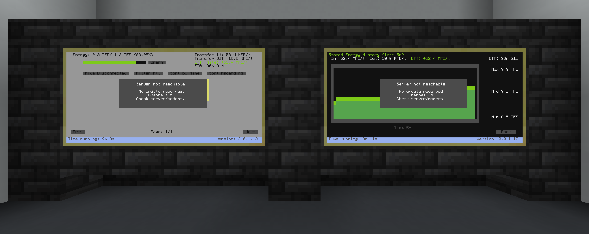
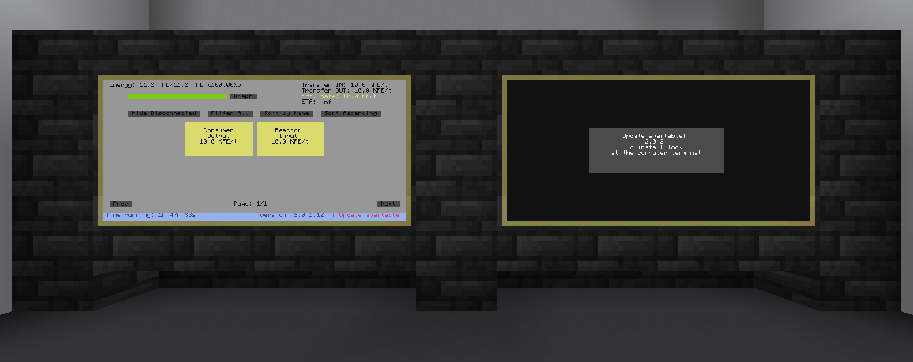

# EnergyMonitor

EnergyMonitor is a ComputerCraft/CC:Tweaked program for monitoring energy storage and transfer rates across multiple computers and peripherals.

A server collects readings from client computers and broadcasts the combined data to one or more monitor computers. The monitor UI shows:

- Total stored energy and capacity
- Input/output transfer rates
- Effective transfer rate and ETA
- Individual storage and transfer devices
- Stored-energy graph view with configurable history size
- Network status warnings



## Overview

- Built for Minecraft modpacks with ComputerCraft or CC:Tweaked.
- Uses wireless modems for communication.
- Uses three roles: `server`, `client`, and `monitor`.
- Supports energy storage clients and transfer-rate clients.
- Includes support for Mekanism, Draconic Evolution, Powah, Advanced Peripherals, Energy Meter, Flux Networks through FNCCT, and generic energy peripherals.
- Installs from Pastebin and tagged GitHub/jsDelivr releases.
- Checks for updates on startup and can install them automatically when enabled in `options.txt`.
- The monitor's `Graph` button opens the stored-energy graph.

---

## Installation

Run this on each ComputerCraft computer that should be part of the EnergyMonitor network:

```sh
pastebin get gUbUpXHt git
git
```

Install one computer as `server`, one or more computers as `client`, and one or more computers as `monitor`. Use the same modem channel on every computer in the same EnergyMonitor network.

## Requirements

- One wireless modem per EnergyMonitor computer
- One server computer
- One or more client computers next to energy peripherals
- One or more monitor computers with attached monitors
- HTTP enabled in the ComputerCraft config

A monitor that is at least 4 blocks wide and 2 blocks high is recommended.

---

## Monitor UI

The monitor shows total energy, fill percentage, input rate, output rate, effective transfer rate, ETA, connected devices, filters, sorting, runtime, and version. The `Graph` button opens the stored-energy graph view, and the graph history size is configurable during monitor setup.

When an update is available, monitor computers show an update notice in the footer.



If the monitor cannot receive server updates, it keeps the UI visible and shows a network notice:



## How It Works

EnergyMonitor is designed for multi-computer setups:

- A `server` collects readings from clients and broadcasts one combined data set.
- A `client` reads one attached energy storage or transfer peripheral.
- A `monitor` displays the server data on an attached monitor.

All computers in the same EnergyMonitor network need a wireless modem and the same modem channel.

---

## Setup Steps

The installer downloads the latest stable tagged release, asks for the computer role, writes `/EnergyMonitor/config/options.txt`, optionally sets the computer label, optionally installs `startup`, and reboots the computer.

Install the computers in this order:

1. Install one computer as `server`.
2. Install one or more computers as `client`.
3. Place each client next to the energy peripheral it should read.
4. Install one or more computers as `monitor`.
5. Attach a monitor to each monitor computer.
6. Use the same modem channel on every server, client, and monitor in that network.

The default modem channel is `5`. If you play on a shared server, choose another channel to avoid colliding with other ComputerCraft programs. Valid channels are `0` through `65535`.

## Installer Choices

The installer asks for:

- Language
- Computer role: `server`, `monitor`, or `client`
- Client peripheral type, only for clients
- Transfer direction, only for transfer clients
- Modem channel/port
- Graph history window in minutes, only for monitors
- Graph save interval in seconds, only for monitors
- Whether the monitor should open the graph view on startup
- Optional computer label
- Optional startup installation

Computer labels are shown in the monitor UI. Useful labels are names like `Reactor Input`, `Main Induction Matrix`, `Storage Core`, or `Base Output`.

---

## Computer Roles

**Server**

The server sends pings to clients, receives their readings, removes clients that stop responding, calculates totals, and broadcasts the combined monitor data. It does not need an attached monitor or energy peripheral.

**Client**

Each client reads one local energy peripheral. During installation, choose either:

- `Energy storage / capacitor`: reports stored energy and capacity.
- `Energy transfer / meter`: reports input rate, output rate, or both.

For transfer clients, choose the direction:

- `Input`: energy entering storage or a system.
- `Output`: energy leaving storage or a system.
- `Both`: report both input and output when the peripheral supports both.

**Monitor**

The monitor displays aggregated server data on an attached monitor. It can show the normal overview or the stored-energy graph. The `Graph` button opens the graph view, and `Back` returns to the overview.

## Supported Peripherals

Supported mods and integrations:

- Mekanism
- Draconic Evolution
- Powah
- Advanced Peripherals
- Energy Meter
- Flux Networks through [FNCCT](https://github.com/TrickShotMLG02/FNCCT)
- Generic ComputerCraft-compatible energy peripherals

Supported peripheral types:

- Generic energy storage peripherals with methods such as `getEnergyStored` and `getMaxEnergyStored`
- Generic transfer peripherals with methods such as `getEnergyTransferInput`, `getTransferRateInput`, or `getTransferRateOutput`
- Mekanism energy devices, including induction ports
- Advanced Peripherals Energy Detector
- Energy Meter peripherals
- FNCCT Flux Networks flux plugs and flux points
- Draconic Evolution energy core storage
- Draconic Evolution energy core transfer
- Draconic Evolution flux gates
- Powah energy cells and ender cells

Some peripherals can act as either storage or transfer devices. For example, Mekanism induction ports can be installed as storage clients or transfer clients. The client installer choice determines which wrapper EnergyMonitor uses.

---

## Configuration

Configuration is stored on each installed ComputerCraft computer at:

```sh
/EnergyMonitor/config/options.txt
```

Important options:

- `program`: `server`, `client`, or `monitor`
- `language`: installed language, such as `en` or `de`
- `peripheralType`: `capacitor`, `transfer`, or `n/a`
- `transferType`: `input`, `output`, `both`, or `n/a`
- `modemChannel`: modem channel/port used by this EnergyMonitor network
- `pingInterval`: how often the server pings clients
- `historyMinutes`: graph history window shown on monitors, from 1 to 120 minutes
- `historySaveInterval`: how often monitors save graph history, from 5 to 3600 seconds
- `monitorOpenGraphOnStart`: whether monitors open the graph view immediately on startup
- `autoUpdate`: set to `1` to install available updates automatically; set to `0` to show an update prompt instead
- `debug`: set to `1` for debug output

After editing `options.txt`, reboot the ComputerCraft computer.

## Updating

EnergyMonitor checks for a newer tag in the same release channel on startup. Stable installations update to newer stable tags. Beta installations update to newer beta tags.

If `autoUpdate = 1`, an available update is installed automatically and the computer reboots. If `autoUpdate = 0`, EnergyMonitor shows an update prompt instead. Existing configuration and monitor graph data are preserved during updates.

Monitor computers also show an update notice in the footer when an update is available.

When a monitor computer restarts and finds an update during startup, it shows a centered update notice with the target version and installation hint:



To reinstall or install a specific release, run the bootstrap again with an argument:

```sh
git beta
git v2
git v2.3
git v2.3.0.0
git v2.3-beta
```

Without an argument, `git` installs the latest stable release.

---

## Troubleshooting

**No modem found**

Attach a wireless modem and reboot the computer. Every role requires a wireless modem.

**Monitor says the server is not reachable**

Check that:

- The server computer is running.
- The monitor and server use the same `modemChannel`.
- Both computers have wireless modems.
- The server is installed as `server`, not `client` or `monitor`.

**Clients do not appear on the monitor**

Check that:

- The server is running.
- Clients and monitors use the same `modemChannel`.
- Every client has a wireless modem.
- The client is installed with the correct client type.
- The client is placed next to the peripheral it should read.
- The peripheral is supported by EnergyMonitor.

**A transfer rate shows `0`**

Some peripherals do not expose every transfer-rate method. EnergyMonitor treats missing methods as `0` instead of crashing. Set `debug = 1` in `options.txt` to see more detail.

**Control Monitor not found**

This happens when a computer installed as `monitor` cannot find an attached monitor peripheral. Attach a monitor directly to the monitor computer or through a wired modem network, then reboot the computer.

**The monitor is too small**

Use a larger attached monitor. A monitor that is at least 4 blocks wide and 2 blocks high is recommended.

**The installer cannot download files**

Make sure HTTP is enabled in the ComputerCraft config and that the computer can reach Pastebin and jsDelivr/GitHub-hosted files.

---

## Repository Layout

- `EnergyMonitor/install/`: bootstrap installer and tagged-release installer
- `EnergyMonitor/start/start.lua`: startup entry point, config loading, class loading, update checks, and role dispatch
- `EnergyMonitor/program/`: server, client, monitor, and Basalt UI runtime
- `EnergyMonitor/classes/`: shared utilities, networking, language support, and peripheral wrappers
- `EnergyMonitor/config/options.txt`: default config template
- `EnergyMonitor/files.txt`: files downloaded by the installer
- `EnergyMonitor/lang/`: language files
- `docs/images/`: README screenshots

## Adding Peripheral Support

Peripheral detection is registry-based. To add support for another mod or custom peripheral:

1. Add the wrapper class under `EnergyMonitor/classes/peripherals/<modName>/`.
2. Load that Lua file in `EnergyMonitor/start/start.lua` inside `initClasses()`, in the `Add Mod Support below` section.
3. Add the new file path to `EnergyMonitor/files.txt` so the installer downloads it.
4. Register a storage or transfer handler in `EnergyMonitor/classes/peripherals/Peripherals.lua`.

Example class path:

```sh
EnergyMonitor/classes/peripherals/myMod/MyStorage.lua
```

Example `start.lua` entry:

```lua
-- My Mod Support
shell.run(periPath.."myMod/MyStorage.lua")
```

Example `files.txt` entry in the `class.files` list:

```lua
"classes/peripherals/myMod/MyStorage.lua",
```

Example storage registration in `Peripherals.lua`:

```lua
_G.registerEnergyStorageSupport({
  label = "My Storage",
  matches = function(ctx)
    return ctx.type == "my_storage_type"
  end,
  create = function(ctx)
    return newMyStorage("id", ctx.peripheral, ctx.name, ctx.type)
  end
})
```

Transfer handlers use the same shape, but usually pass `ctx.transferType` to the wrapper constructor. Put more specific handlers before fallback handlers so a custom peripheral is not claimed by generic method detection first.

For a concrete implementation example, see [commit `f6869c5`](https://github.com/TrickShotMLG02/EnergyMonitor/commit/f6869c5).

---

## Releases

Versioning is tag-based:

- Stable releases use tags like `v2.3`, `v2.3.0`, or `v2.3.0.0`.
- Beta releases use tags like `v2.3-beta`.
- Missing trailing version parts are treated as zeros, so `v2.3`, `v2.3.0`, and `v2.3.0.0` compare the same way.
- `v3` compares as `v3.0.0.0`.
- The installer can fetch the latest stable tag, the latest beta tag, or a specific tag.
- The `v2.0.0` tag is the compatibility installer anchor for older installs and updates.

To publish a release, commit the code and create the matching tag. To publish a beta, tag the commit with the `-beta` suffix.

---

## License

EnergyMonitor is licensed under the MIT License. See [LICENSE](LICENSE).

Parts of this project were originally derived from MIT-licensed ComputerCraft reactor control projects:

- [ExtremeReactorControl](https://gitlab.com/seekerscomputercraft/extremereactorcontrol) by SeekerOfHonjo, primarily from the March 11, 2024 tree at commit `f0f223ec`
- [Reactor-and-Turbine-control-program](https://github.com/ThorsCrafter/Reactor-and-Turbine-control-program) by Thor_s_Crafter

Several files have since been heavily rewritten for EnergyMonitor, while some helper classes, installer/startup structure, transport message wrappers, and peripheral wrapper patterns still carry upstream lineage. The root license file keeps the required MIT notices for those portions.

EnergyMonitor also bundles the third-party Basalt UI library in `EnergyMonitor/program/basalt.lua`. Basalt is MIT-licensed by Robert Jelic / Pyroxenium. See [THIRD_PARTY_NOTICES.md](THIRD_PARTY_NOTICES.md) for the bundled Basalt notice and license text.

---

## Contributing

Contributions are welcome, especially support for more energy peripherals, monitor UI improvements, installer improvements, and bug fixes.

Please make pull requests easy to review:

- Create the change in a fork of this repository.
- Use a separate branch with a clear name, such as `feature/powah-buffer-support`, `fix/modem-timeout-notice`, or `docs/custom-peripherals`.
- Keep each pull request focused on one purpose.
- Document user-facing changes in this README when setup, configuration, supported peripherals, or troubleshooting changes.
- Add new downloaded files to `EnergyMonitor/files.txt`; otherwise the installer will not fetch them.
- Add newly supported mods or integrations to the supported peripherals list in this README.
- Describe what changed in the PR description and mention why the change is needed.
- Include how you tested the change, for example the ComputerCraft role, attached peripheral type, modem channel, and monitor UI state.
- Include screenshots for monitor UI changes when possible.
- Avoid changing default configuration or update behavior unless the PR explains the impact.
- Do not commit local IDE files, temporary files, logs, or ComputerCraft runtime state.

For new peripheral support, include the peripheral type name, exposed methods, mod name/version if known, and whether the device acts as storage, transfer, or both.
